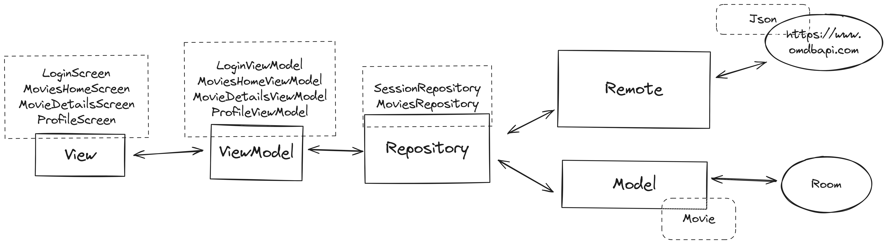

# Assurance Technology Pte Ltd Android Tech Assessment

# Context

This project is an Android tech assessment undertaken using the Kotlin programming language and Jetpack Compose framework. Jetpack Compose was chosen for its declarative UI approach, aligning with current industry trends. While this project marks my first experience with Jetpack Compose and integrating GraphQL, it's essential to note that the implementation is not production-ready.

Some features remain incomplete due to time constraints, as outlined below:

### Did Not Manage to Do

- Add a search bar and filter for the movies
- Others which marked as `TODO` in the codebase.

# Architecture
The project follows the Model View ViewModel architecture, with repository pattern in Jetpack Compose.

The chosen database technology is Room, and the network layer is implemented using Retrofit.

# Functional Requirements

### Movies

- **Movie List:** Displays a paginated list of movies. For now, the list is fetched from API, and only for Marvel movies.
- **Movie Details:** Displays the details of a clicked movie, with overview, backsplash, image, language, released date and ratings,
- **Search:** Implementation is pending due to time constraints

### My Profile
- **Logout:** Users can log out, deleting the stored JWT and returning to the login screen.
> **🚧** There is no backend implementation for this feature, so the JWT is not stored.